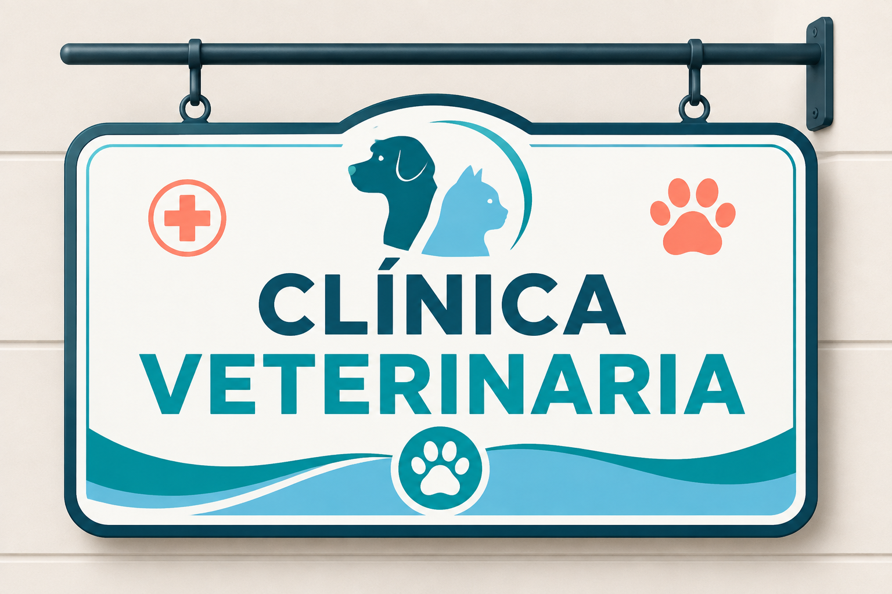

# Proyecto de Clase: Sistema de Gestión de Veterinaria - Base de Datos

## Integrantes

- Andrés Felipe Rivera Carreño - 2250193
- Carlos Iván Merlano Vergara - 2250188
- Jannyer Stiven Caballero Domínguez - 2250191
- Juan Sebastián Araujo Contreras - 2250142
- Juan Pablo Vera Suárez - 2241807

---

## 1. Conceptos Fundamentales

- **Propietario o responsable:** Persona encargada del animal y responsable de autorizar su atención. Un propietario puede registrar múltiples mascotas, estableciendo una relación **1:N**. Sus datos personales deben protegerse conforme a la normativa vigente.

- **Paciente (mascota):** Animal doméstico atendido en la clínica. Se almacena información como nombre, especie, raza, sexo, edad, color, peso y alergias.

- **Historia clínica veterinaria:** Registro cronológico, privado y reservado que reúne la información relacionada con signos vitales, consultas, diagnósticos, tratamientos, procedimientos y evolución del paciente.

- **Cita y atención:** La cita permite gestionar la reserva de fecha, hora y profesional encargado, mientras que la atención registra los eventos que realmente ocurrieron durante la consulta.

- **Servicio veterinario:** Actividad ofrecida por la clínica, como consulta, cirugía, laboratorio, hospitalización o vacunación. Los servicios pueden activarse, desactivarse o modificar su precio.

- **Consentimiento informado:** Autorización firmada por el propietario o responsable para realizar procedimientos que pueden implicar algún riesgo, como cirugías o aplicación de anestesia.

- **Inventario y farmacia:** Permite controlar medicamentos, vacunas e insumos, registrando cantidades disponibles, lotes, proveedores y fechas de vencimiento.

- **Facturación y pagos:** Módulo encargado de registrar los servicios prestados, productos vendidos, valores totales y medios de pago utilizados, como efectivo, tarjeta de crédito, tarjeta débito, Addi o Sistecrédito.

- **Seguridad y privacidad:** Control de acceso al sistema mediante usuarios, roles y permisos, además de mecanismos de respaldo de información y auditoría.

- **Diagnóstico, tratamiento y prescripción:** Permite almacenar las enfermedades identificadas, medicamentos formulados, dosis, frecuencia, duración del tratamiento y recomendaciones realizadas por el profesional.

- **Vacunación** Control de las vacunas aplicado a cada mascota, registrando el tipo de vacuna, fecha de aplicación, lote, profesional responsable y próxima dosis programada. 

---

## 2. Tendencias Actuales en el Sector

- **Sistemas en la nube:** Permiten el acceso remoto, seguro y sincronizado a agendas, historias clínicas y demás información desde múltiples dispositivos y sedes.

- **Integración de procesos:** Uso de plataformas unificadas que centralizan la agenda, la gestión clínica, el inventario y la facturación, reduciendo la duplicidad de información.

- **Recordatorios automatizados:** Envío automático de notificaciones mediante servicios de mensajería para recordar citas, vacunas y chequeos médicos pendientes.

- **Uso de inteligencia artificial:** Herramientas de apoyo para la transcripción de consultas, organización de información y análisis de imágenes, siempre bajo supervisión veterinaria.

- **Gestión predictiva de inventario:** Automatización del control de existencias para descontar insumos utilizados y generar alertas sobre productos próximos a vencer o con bajo nivel de stock.

---

## 3. Herramientas de Referencia en el Mercado

Como parte de la exploración inicial, se analizaron tres herramientas utilizadas para la gestión de clínicas veterinarias:

### ezyVet

Destaca por sus funciones avanzadas, su alto nivel de personalización y la generación de reportes detallados. Sin embargo, debido a la cantidad de funcionalidades que ofrece, puede presentar una mayor complejidad de uso y un costo elevado.

### VETport

Ofrece flujos de trabajo configurables y está orientado a brindar versatilidad a clínicas veterinarias, incluyendo aquellas que trabajan de manera móvil o cuentan con múltiples sedes.

### DVMAX Cloud

Está orientado a simplificar las operaciones diarias de una clínica veterinaria mediante herramientas para la gestión de historiales clínicos, personalización de registros y manejo integrado de pagos.

---

## 4. Referencias Bibliográficas

- Carastro, G. (2025). *Considerations for choosing veterinary practice management software*. American Animal Hospital Association.

- Congreso de Colombia. (2000). *Ley 576 de 2000: Código de Ética para el ejercicio profesional de la medicina veterinaria*.

- Congreso de Colombia. (2012). *Ley Estatutaria 1581 de 2012: Protección de datos personales*.

- ezyVet. (s. f.). *Features*. Recuperado de https://www.ezyvet.com/features

- Pereira Bengoa, V. (2018). *La historia clínica y el consentimiento informado en medicina veterinaria en Colombia*. Consejo Profesional de Medicina Veterinaria y de Zootecnia de Colombia.

- Polapragada, S. (2026). *AI applications in veterinary digital health: A systematic survey*. Frontiers in Veterinary Science.

- VETport. (s. f.). *Cloud veterinary practice management software*. Recuperado de https://www.vetport.com/