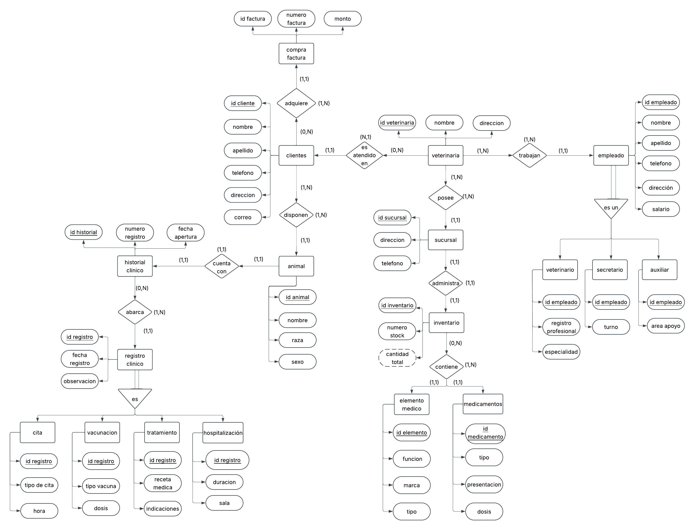
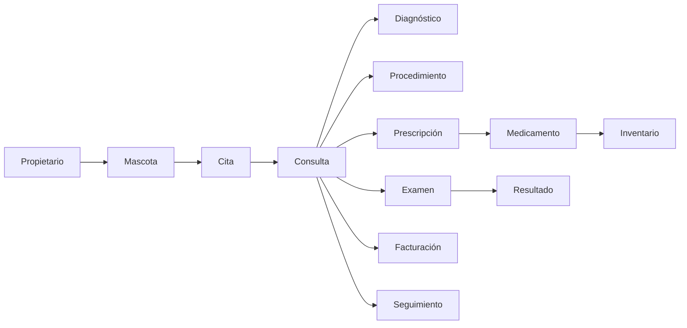

# PetManager — Sistema de Gestión para una Clínica Veterinaria

**Entrega 1 — Bases de Datos I**  
Universidad Industrial de Santander · Escuela de Ingeniería de Sistemas e Informática

> **PetManager** es el diseño de una base de datos para una clínica veterinaria enfocada en animales domésticos, integrando propietarios, mascotas, citas, historia clínica, tratamientos, vacunación, exámenes, inventario, facturación y seguimiento bajo un mismo modelo de datos.

---

## Integrantes del grupo

| # | Nombre completo | Código |
|---|---|---|
| 1 | [Nombre del integrante 1] | [Código] |
| 2 | [Nombre del integrante 2] | [Código] |
| 3 | [Nombre del integrante 3] | [Código] |
| 4 | [Nombre del integrante 4] | [Código] |
| 5 | [Nombre del integrante 5] | [Código] |

---

## Contenido

1. [Contexto del problema trabajado en la actividad de exploración](#1-contexto-del-problema-trabajado-en-la-actividad-de-exploración)
2. [Consulta de tendencias actuales en el área del proyecto](#2-consulta-de-tendencias-actuales-en-el-área-del-proyecto)
3. [Consulta de herramientas o sistemas similares con su análisis de funcionalidades](#3-consulta-de-herramientas-o-sistemas-similares-con-su-análisis-de-funcionalidades)
4. ## 4. Modelo E-R del proyecto 
5. [Referencias](#referencias)

---

## 1. Contexto del problema trabajado en la actividad de exploración

### 1.1 Situación

Las clínicas veterinarias manejan una cantidad creciente de información relacionada con la atención de animales domésticos. Cada paciente posee datos de identificación, antecedentes, consultas, diagnósticos, tratamientos, vacunas, exámenes y controles. Al mismo tiempo, la clínica debe administrar propietarios, profesionales, citas, productos, medicamentos, inventario, facturación y pagos.

Cuando estos datos se almacenan en agendas físicas, hojas de cálculo o archivos independientes, aparecen problemas de duplicidad, pérdida de información y dificultad para consultar el historial completo de una mascota.

La operación de una clínica veterinaria presenta situaciones que requieren una estructura de datos organizada:

- Un propietario puede tener **varias mascotas** registradas.
- Una mascota puede tener **múltiples consultas** a lo largo de su vida.
- Una cita puede ser programada, confirmada, reprogramada, cancelada o atendida.
- Una consulta puede registrar **varios diagnósticos, procedimientos, exámenes o medicamentos**.
- Los medicamentos y vacunas pueden manejar **lotes y fechas de vencimiento**.
- Una atención puede generar productos utilizados, servicios prestados y una factura.
- Una factura puede contener varios conceptos y recibir uno o varios pagos.
- Una mascota puede requerir controles posteriores o nuevas aplicaciones de vacunas.
- Los empleados de la clínica necesitan diferentes niveles de acceso al sistema.

### 1.2 Problema de datos

> ¿Cómo modelar una única base de datos que permita a una clínica veterinaria gestionar propietarios, mascotas, citas, consultas, historia clínica, diagnósticos, tratamientos, vacunas, exámenes, inventario, facturación, pagos, personal y seguimiento, evitando duplicidad de información y conservando el historial de cada paciente?

El sistema debe relacionar correctamente la información clínica con la administrativa. Una cita no representa necesariamente una consulta realizada; un medicamento no es lo mismo que una prescripción; una factura puede existir antes de que se complete el pago; y una solicitud de examen puede permanecer pendiente hasta recibir un resultado.

PetManager busca mantener cada uno de estos elementos como parte de una estructura relacionada que permita consultar la información de forma rápida y consistente.

### 1.3 Alcance

**Dentro del alcance**

- Registro de propietarios.
- Registro de mascotas.
- Gestión de especies y razas.
- Programación de citas.
- Asignación de veterinarios.
- Registro de consultas.
- Historia clínica.
- Diagnósticos.
- Signos vitales.
- Procedimientos.
- Prescripciones.
- Medicamentos.
- Vacunación.
- Solicitud de exámenes.
- Registro de resultados.
- Inventario de productos e insumos.
- Lotes y fechas de vencimiento.
- Proveedores.
- Movimientos de inventario.
- Facturación.
- Registro de pagos.
- Seguimientos y controles.
- Usuarios, roles y permisos.
- Auditoría básica.
- Reportes de operación.

**Fuera del alcance de esta entrega**

- Nómina.
- Contabilidad completa.
- Obligaciones tributarias.
- Integraciones reales con pasarelas de pago.
- Integraciones reales con laboratorios externos.
- Aplicación móvil.
- Telemedicina implementada.
- Inteligencia artificial implementada.
- Gestión avanzada de hospitalización.
- Gestión de quirófanos.
- Diseño final de interfaz de usuario.

### 1.4 Conceptos clave del dominio

| Concepto | Descripción |
|---|---|
| **Propietario** | Persona responsable de una o varias mascotas registradas en la clínica. |
| **Mascota** | Paciente atendido por la clínica. Contiene información como nombre, especie, raza, sexo y fecha de nacimiento. |
| **Cita** | Reserva de fecha y hora para la atención de una mascota. |
| **Consulta** | Atención clínica realizada a un paciente por un veterinario. |
| **Veterinario** | Profesional encargado de realizar y registrar la atención clínica. |
| **Historia clínica** | Conjunto de registros clínicos generados durante la vida del paciente. |
| **Diagnóstico** | Enfermedad, condición o problema identificado durante una consulta. |
| **Procedimiento** | Actividad clínica realizada al paciente durante una atención. |
| **Prescripción** | Indicación de uno o varios medicamentos con dosis, frecuencia, vía y duración. |
| **Medicamento** | Producto farmacológico utilizado o vendido por la clínica. |
| **Vacuna** | Producto biológico utilizado para prevenir enfermedades. |
| **Vacunación** | Registro de una vacuna aplicada a una mascota. |
| **Examen** | Prueba diagnóstica solicitada durante una atención. |
| **Resultado** | Información obtenida después de realizar un examen. |
| **Producto** | Medicamento, vacuna, alimento o insumo controlado por inventario. |
| **Lote** | Grupo de unidades de un producto con identificación y vencimiento común. |
| **Movimiento de inventario** | Entrada, salida, ajuste, devolución o baja de un producto. |
| **Factura** | Documento que agrupa los servicios y productos cobrados. |
| **Pago** | Registro de un valor recibido para cancelar total o parcialmente una factura. |
| **Seguimiento** | Control posterior programado para revisar la evolución de una mascota. |
| **Usuario / Rol / Permiso** | Elementos utilizados para administrar el acceso a la plataforma. |
| **Auditoría** | Registro de operaciones relevantes realizadas dentro del sistema. |

### 1.5 Reglas de negocio identificadas

1. Un propietario puede tener una o varias mascotas.
2. Cada mascota debe estar asociada a un propietario o responsable.
3. Una mascota puede tener varias citas.
4. Cada cita pertenece a una sola mascota.
5. Una cita puede estar asignada a un veterinario.
6. Una mascota puede tener muchas consultas a lo largo del tiempo.
7. Cada consulta tiene un veterinario responsable.
8. Una consulta puede registrar uno o varios diagnósticos.
9. Una consulta puede incluir varios procedimientos.
10. Una consulta puede generar una o varias prescripciones.
11. Una prescripción puede contener varios medicamentos.
12. La dosis, frecuencia, vía y duración pertenecen a la prescripción del medicamento.
13. Una mascota puede recibir múltiples vacunas.
14. Cada vacunación debe conservar la fecha y el producto utilizado.
15. Una solicitud de examen debe estar relacionada con una consulta.
16. Un resultado debe corresponder a una solicitud de examen.
17. Un producto puede pertenecer a uno o varios lotes.
18. Cada movimiento de inventario debe registrar producto, cantidad, fecha y tipo de movimiento.
19. Una factura puede contener varios productos y servicios.
20. Una factura puede recibir uno o varios pagos.
21. Un seguimiento debe estar asociado a una mascota.
22. Un usuario puede tener uno o varios roles.
23. Los roles determinan los permisos disponibles.
24. Los cambios importantes en datos clínicos, financieros o de inventario deben quedar registrados.

### 1.6 Preguntas que la base de datos debe poder responder

- ¿Cuántas mascotas fueron atendidas durante un día?
- ¿Qué citas están programadas para una fecha determinada?
- ¿Qué veterinario tiene más citas asignadas?
- ¿Cuál fue la última consulta de una mascota?
- ¿Qué diagnósticos ha tenido un paciente?
- ¿Qué medicamentos se le han formulado?
- ¿Qué vacunas tiene aplicadas una mascota?
- ¿Qué vacunas requieren próximo refuerzo?
- ¿Qué pacientes tienen controles pendientes?
- ¿Qué exámenes aún no tienen resultado?
- ¿Qué productos tienen pocas existencias?
- ¿Qué lotes están próximos a vencer?
- ¿Qué productos tienen mayor movimiento?
- ¿Cuánto facturó la clínica durante un periodo?
- ¿Cuánto dinero está pendiente por cobrar?
- ¿Qué servicios se prestan con mayor frecuencia?
- ¿Qué métodos de pago son más utilizados?
- ¿Qué propietarios tienen varias mascotas?
- ¿Qué pacientes no han regresado a un control programado?
- ¿Qué usuario realizó una modificación determinada?

---

## 2. Consulta de tendencias actuales en el área del proyecto

### 2.1 Tendencias del negocio

| Tendencia | En qué consiste |
|---|---|
| **Digitalización de la práctica veterinaria** | Migración de registros físicos hacia sistemas que integran agenda, historia clínica, inventario y facturación. |
| **Atención preventiva** | Mayor seguimiento de vacunas, desparasitación, controles periódicos y prevención de enfermedades. |
| **Servicios especializados** | Expansión hacia laboratorio, imagenología, odontología, dermatología, cirugía y otras especialidades. |
| **Comunicación con propietarios** | Uso de recordatorios, confirmaciones y envío de información mediante canales digitales. |
| **Experiencia del cliente** | Reducción de tiempos de espera y facilidad para programar citas, pagar y recibir resultados. |
| **Control de inventario** | Seguimiento de medicamentos, vacunas e insumos por cantidad, lote y vencimiento. |
| **Uso de indicadores** | Análisis de citas, pacientes, servicios, ingresos e inventario para apoyar decisiones administrativas. |

### 2.2 Tendencias tecnológicas

| Tendencia | En qué consiste |
|---|---|
| **Sistemas en la nube** | Acceso a la plataforma desde diferentes equipos sin depender de un único computador local. |
| **Reservas digitales** | Programación de citas mediante páginas web, aplicaciones o formularios en línea. |
| **Telemedicina** | Seguimiento u orientación de determinados casos mediante atención remota. |
| **Inteligencia artificial** | Apoyo en transcripción, notas clínicas, automatización y análisis de información. |
| **Integración diagnóstica** | Conexión entre el sistema de gestión y servicios de laboratorio o imagenología. |
| **Inventario por lotes** | Control de trazabilidad, vencimiento y utilización de productos específicos. |
| **Recordatorios automáticos** | Notificaciones de citas, vacunas, controles, resultados o tratamientos. |
| **Analítica operativa** | Generación de tableros e indicadores a partir de información histórica. |
| **Seguridad y auditoría** | Gestión de usuarios, roles, permisos y registro de acciones realizadas. |

### 2.3 Cómo estas tendencias impactan el diseño de la base de datos

| Tendencia | Decisión de modelado |
|---|---|
| Historia clínica digital | `CONSULTA` conserva cada atención de forma independiente y se relaciona con `MASCOTA`. |
| Servicios especializados | `SERVICIO` se mantiene como catálogo para permitir nuevos tipos de atención. |
| Reservas digitales | `CITA` registra fecha, hora, estado, motivo y profesional. |
| Telemedicina | La cita puede manejar una modalidad de atención. |
| Inteligencia artificial | El sistema puede conservar el origen y validación de registros generados automáticamente. |
| Integración diagnóstica | `SOLICITUD_EXAMEN` y `RESULTADO_EXAMEN` se manejan por separado. |
| Inventario por lotes | `LOTE` se relaciona con `PRODUCTO` y conserva fecha de vencimiento. |
| Trazabilidad de inventario | `MOVIMIENTO_INVENTARIO` conserva entradas, salidas, ajustes y bajas. |
| Recordatorios | `SEGUIMIENTO` y `NOTIFICACION` permiten manejar fechas y estados. |
| Seguridad | `USUARIO`, `ROL`, `PERMISO` y `AUDITORIA` controlan el acceso y las acciones. |
| Analítica | Las fechas, estados y relaciones se almacenan para generar indicadores mediante consultas. |

---

## 3. Consulta de herramientas o sistemas similares con su análisis de funcionalidades

Se analizaron cuatro plataformas comerciales de gestión veterinaria para identificar funcionalidades frecuentes en este tipo de sistemas.

### 3.1 ezyVet

Plataforma de gestión veterinaria basada en la nube orientada a clínicas y hospitales.

**Funcionalidades analizadas**

- Gestión de propietarios y pacientes.
- Agenda y calendario.
- Historia clínica.
- Prescripciones.
- Facturación.
- Pagos.
- Inventario.
- Órdenes de compra.
- Reportes.
- Integraciones con servicios externos.

### 3.2 IDEXX Neo

Sistema veterinario en la nube orientado a la gestión clínica y administrativa.

**Funcionalidades analizadas**

- Agenda.
- Gestión de pacientes.
- Historia clínica.
- Notas de examen.
- Facturación.
- Pagos.
- Comunicación con clientes.
- Reportes.
- Integración con herramientas diagnósticas.

### 3.3 Covetrus Pulse

Plataforma de gestión veterinaria que integra funciones clínicas, administrativas y de comunicación.

**Funcionalidades analizadas**

- Gestión de clientes y pacientes.
- Programación de citas.
- Reservas en línea.
- Flujo clínico.
- Comunicación con propietarios.
- Pagos.
- Automatización.
- Integraciones.
- Herramientas asistidas por inteligencia artificial.

### 3.4 Digitail

Plataforma veterinaria enfocada en historia clínica electrónica, automatización y comunicación.

**Funcionalidades analizadas**

- Gestión de propietarios y mascotas.
- Agenda.
- Historia clínica.
- Facturación.
- Inventario.
- Comunicación con clientes.
- Recordatorios.
- Reportes.
- Automatización.
- Funciones asistidas por inteligencia artificial.

### 3.5 Cuadro comparativo de funcionalidades

| Funcionalidad | ezyVet | IDEXX Neo | Covetrus Pulse | Digitail | PetManager |
|---|---:|---:|---:|---:|---:|
| Propietarios y mascotas | ✔ | ✔ | ✔ | ✔ | ✔ |
| Historia clínica | ✔ | ✔ | ✔ | ✔ | ✔ |
| Agenda de citas | ✔ | ✔ | ✔ | ✔ | ✔ |
| Diagnósticos y tratamientos | ✔ | ✔ | ✔ | ✔ | ✔ |
| Prescripciones | ✔ | ✔ | ✔ | ✔ | ✔ |
| Vacunación | ✔ | ✔ | ✔ | ✔ | ✔ |
| Facturación | ✔ | ✔ | ✔ | ✔ | ✔ |
| Pagos | ✔ | ✔ | ✔ | ✔ | ✔ |
| Inventario | ✔ | ✔ / integrable | Parcial / integrable | ✔ | ✔ |
| Laboratorio / diagnóstico | Integrable | ✔ | Integrable | Integrable | ✔ |
| Comunicación | ✔ | ✔ | ✔ | ✔ | Planeado |
| Reportes | ✔ | ✔ | ✔ | ✔ | ✔ |
| Sistema en la nube | ✔ | ✔ | ✔ | ✔ | Planeado |
| IA / automatización | Parcial | Parcial | ✔ | ✔ | Fuera de alcance |
| Telemedicina | Integrable | Integrable | Integrable | Integrable | Fuera de alcance |
| Roles y permisos | ✔ | ✔ | ✔ | ✔ | ✔ |
| Auditoría | Parcial | Parcial | Parcial | Parcial | ✔ |

> *Parcial* o *Integrable* indica que la funcionalidad puede depender de módulos, configuración o integraciones adicionales.

### 3.6 Conclusiones del análisis

1. Las plataformas revisadas utilizan la **historia clínica** como elemento central para organizar la información del paciente.
2. Todas incluyen mecanismos para gestionar **propietarios, mascotas y citas**.
3. La **facturación y los pagos** forman parte de la operación administrativa básica.
4. El manejo de **inventario** adquiere importancia cuando la clínica comercializa o utiliza medicamentos, vacunas e insumos.
5. La integración con **laboratorio e imagenología** permite relacionar los resultados directamente con el paciente.
6. La **comunicación digital** con propietarios se utiliza para recordatorios, confirmaciones y seguimiento.
7. Los sistemas actuales tienden a funcionar en la **nube** y requieren control de usuarios y permisos.
8. La **automatización y la inteligencia artificial** aparecen como funciones adicionales en plataformas recientes.
9. PetManager incorpora las funciones fundamentales dentro del alcance del proyecto y deja las funciones más avanzadas para etapas posteriores.

---

## Referencias

- ezyVet. *Veterinary Practice Management Software.*  
  https://www.ezyvet.com/veterinary-practice-management-software

- IDEXX. *Neo Veterinary Software.*  
  https://software.idexx.com/products/neo

- Covetrus. *Covetrus Pulse — Veterinary Practice Management Software.*  
  https://covetrus.com/covetrus-platform/workflow-and-productivity-tools/covetrus-pulse/

- Digitail. *Veterinary Practice Management Software.*  
  https://digitail.com/

- American Veterinary Medical Association (AVMA). *Veterinary telehealth resources.*  
  https://www.avma.org/

- UC Davis School of Veterinary Medicine. *Telemedicine Appointments.*  
  https://www.vetmed.ucdavis.edu/hospital/schedule-appointment/telemedicine
