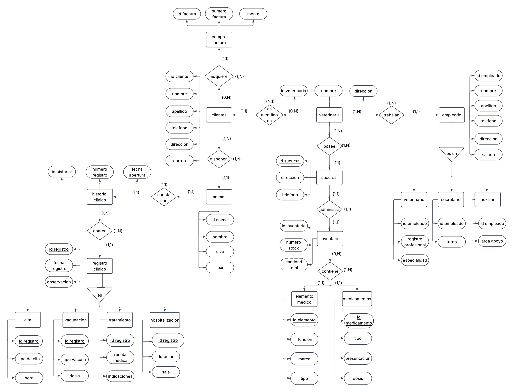

# Modelo entidad-relación

**Diagramas de la primera entrega**

[Volver a Modelo E-R](../README.md) · [Leer documento de la entrega](../Documento/README.md) · [Ir al inicio](../../README.md)

Esta carpeta conserva las dos versiones gráficas del modelo E-R de PetManager: la propuesta inicial y el diagrama utilizado en la primera entrega.

## Archivos

| Archivo | Versión | Uso |
| --- | --- | --- |
| [Modelo_Entidad_Relacion.png](./Modelo_Entidad_Relacion.png) | Modelo de la primera entrega | Consultar las entidades y relaciones de la propuesta entregada. |
| [Primera_Propuesta.png](./Primera_Propuesta.png) | Propuesta inicial | Revisar el antecedente del proceso de modelado. |

## Modelo de la primera entrega

[Ver imagen en tamaño completo](./Modelo_Entidad_Relacion.png)

## Cómo consultar el diagrama

Abre la imagen en tamaño completo para leer los nombres de las entidades, sus atributos y las relaciones. El [documento de la primera entrega](../Documento/README.md) explica el contexto de la propuesta y conserva una copia del diagrama en su anexo.

## Paso al modelo relacional

La segunda entrega transforma el diseño E-R en tablas con atributos, tipos de dato y restricciones. Consulta el [modelo relacional normalizado](../../Modelo%20Relacional/Modelo%20Relacional%20Normalizado/) y el [informe de normalización](../../Modelo%20Relacional/Informe%20de%20Normalizaci%C3%B3n/) para seguir el desarrollo.
