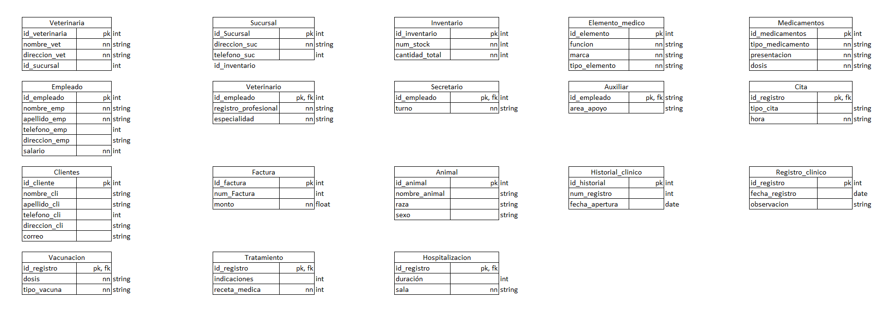

# Modelo Relacional Normalizado

Esta carpeta contiene el modelo relacional normalizado correspondiente al proyecto **PetManager**, desarrollado para la asignatura de **Bases de Datos 1**.

## Descripción

El modelo relacional representa la estructura de la base de datos del sistema PetManager, organizando la información en diferentes relaciones o tablas de acuerdo con las entidades y procesos identificados durante el desarrollo del proyecto.

En este modelo se encuentran representadas las principales áreas del sistema, incluyendo la gestión de veterinarias, sucursales, inventario, elementos médicos, medicamentos, empleados, clientes, animales, facturación e información clínica.

Cada tabla presenta sus respectivos atributos y permite identificar las **claves primarias (PK)** y **claves foráneas (FK)** utilizadas para establecer las relaciones entre las diferentes partes de la base de datos.

La estructura presentada corresponde al modelo obtenido después del proceso de normalización, buscando mantener la información organizada, reducir la redundancia de datos y facilitar la integridad y consistencia de la información almacenada.

## Modelo Relacional

A continuación se presenta el diagrama completo del modelo relacional normalizado de PetManager.

## Archivo

**ModeloRelacionalNormalizado-PetManager.png**  
Diagrama visual del modelo relacional normalizado utilizado para representar la estructura de la base de datos de PetManager.
